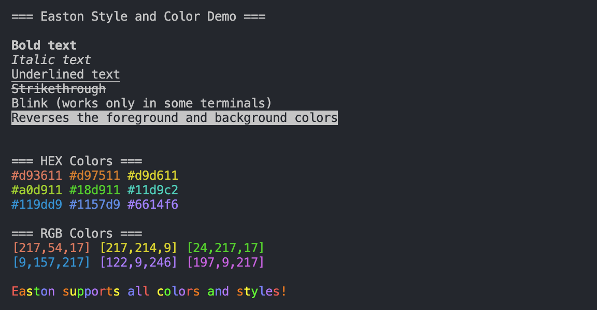
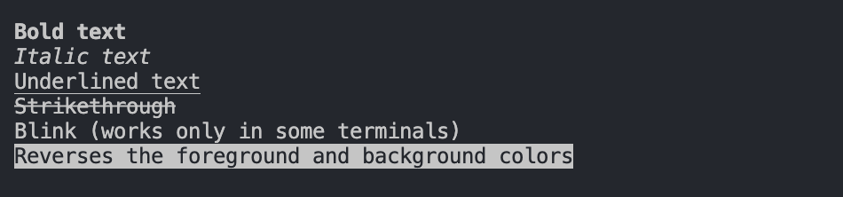

# Easton

Use ANSI styles and HEX/RGB in CLI




## Quick Start

Get **easton** up and running quickly!

1. **Run**:
    ```bash
    npm install easton
    ```
    ```bash
    pnpm install easton
    ```
    ```bash
    yarn add easton
    ```
    ```bash
    bun add easton
    ```
2. **Use**:

    ### ESM (ECMAScript Modules)
    ```javascript
    import easton from 'easton';

    // Basic usage
    console.log(easton('bold')('This is bold text'));
    console.log(easton('#FF0000')('This is red text'));
    console.log(easton(255, 0, 0)('This is also red text'));

    // Combining styles and colors
    console.log(easton('#00FF00', 'bold', 'underline')('Green, bold, and underlined'));

    // Nesting styles
    console.log(easton('bold')(
      'Bold ' + easton('#FF0000')('and red ') + 'text'
    ));
    ```

    ### CJS (CommonJS)
    ```javascript
    const easton = require('easton');

    // Basic usage
    console.log(easton('bold')('This is bold text'));
    console.log(easton('#FF0000')('This is red text'));
    console.log(easton(255, 0, 0)('This is also red text'));

    // Combining styles and colors
    console.log(easton('#00FF00', 'bold', 'underline')('Green, bold, and underlined'));

    // Nesting styles
    console.log(easton('bold')(
      'Bold ' + easton('#FF0000')('and red ') + 'text'
    ));
    ```

## Usage

Easton provides a simple and intuitive API for styling your console output:

```javascript
easton(...styles)(text)
```

Where `styles` can be:
- Hex color codes (e.g., '#FF0000')
- RGB values (e.g., 255, 0, 0)
- Style names (e.g., 'bold', 'italic')

You can combine multiple styles by passing them as separate arguments.

## Available Styles
- `bold`: **Bold text**  
- `italic`: *Italic text*  
- `underline`: Underlined text  
- `strikethrough`: ~~Strikethrough~~  
- `blink`: (blink - works only in some terminals)  
- `inverse`: Reverses the foreground and background colors  
- `hidden`: Hidden text



## Colors

Easton supports:
- Full HEX color codes (e.g., '#FF00FF')
- RGB values (e.g., 255, 0, 255)

## Examples

### ESM (ECMAScript Modules)
```javascript
import easton from 'easton';

// Basic styles
console.log(easton('bold')('Bold text'));
console.log(easton('italic')('Italic text'));
console.log(easton('underline')('Underlined text'));

// HEX colors
console.log(easton('#FF0000')('Red text'));
console.log(easton('#00FF00')('Green text'));
console.log(easton('#0000FF')('Blue text'));

// RGB colors
console.log(easton(255, 0, 0)('Red text'));
console.log(easton(0, 255, 0)('Green text'));
console.log(easton(0, 0, 255)('Blue text'));

// Combining styles and colors
console.log(easton('#FF00FF', 'bold', 'underline')('Bold, underlined magenta text'));

// Nesting styles
console.log(easton('bold')(
  'This is bold ' + easton('#FF0000')('and red ') + 'text'
));
```

### CJS (CommonJS)
```javascript
const easton = require('easton');

// Basic styles
console.log(easton('bold')('Bold text'));
console.log(easton('italic')('Italic text'));
console.log(easton('underline')('Underlined text'));

// HEX colors
console.log(easton('#FF0000')('Red text'));
console.log(easton('#00FF00')('Green text'));
console.log(easton('#0000FF')('Blue text'));

// RGB colors
console.log(easton(255, 0, 0)('Red text'));
console.log(easton(0, 255, 0)('Green text'));
console.log(easton(0, 0, 255)('Blue text'));

// Combining styles and colors
console.log(easton('#FF00FF', 'bold', 'underline')('Bold, underlined magenta text'));

// Nesting styles
console.log(easton('bold')(
  'This is bold ' + easton('#FF0000')('and red ') + 'text'
));
```

## Contributing

We welcome contributions to **easton**! Whether it's reporting a bug, suggesting an enhancement, or submitting a pull request, your input is valued.

## License

This project is licensed under the MIT License - see the [LICENSE](LICENSE) file for details.

## Contact

For any questions, suggestions, or feedback, please contact [love1ace](mailto:lovelacedud@gmail.com).